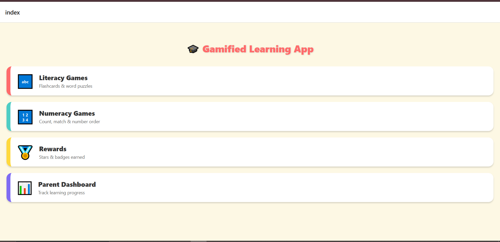
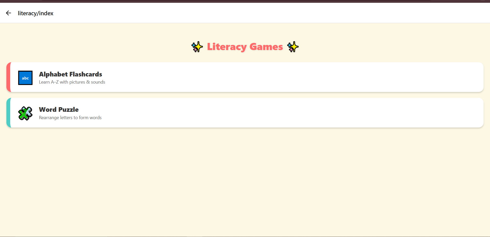
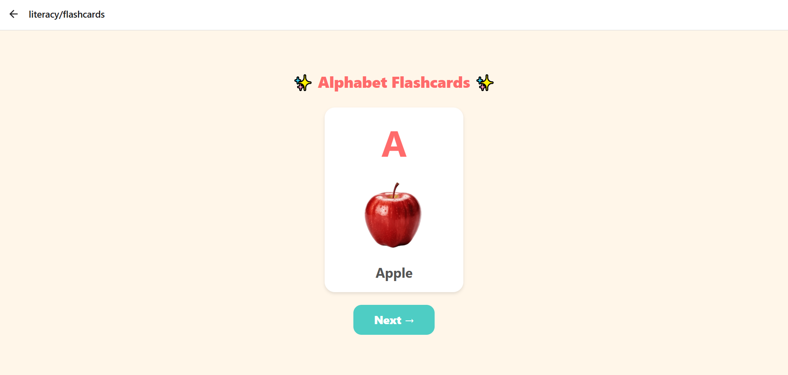
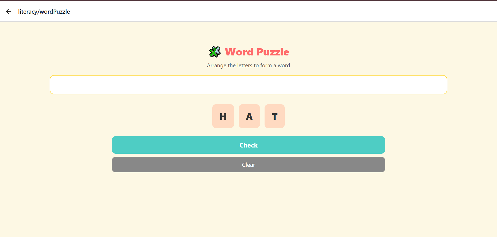
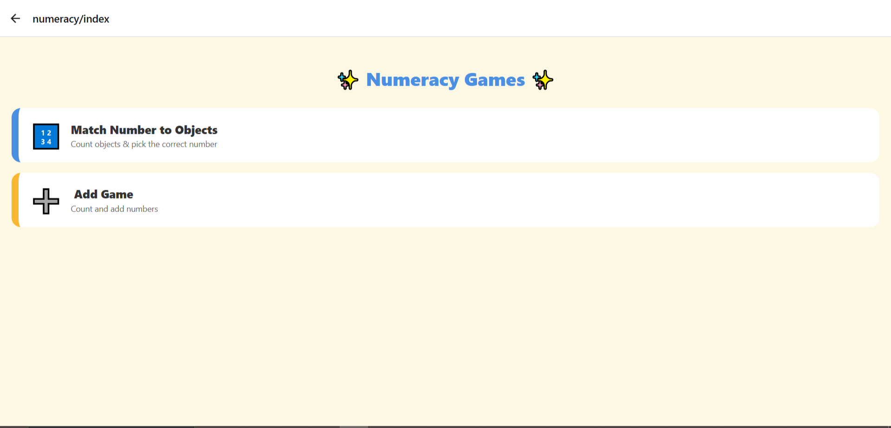
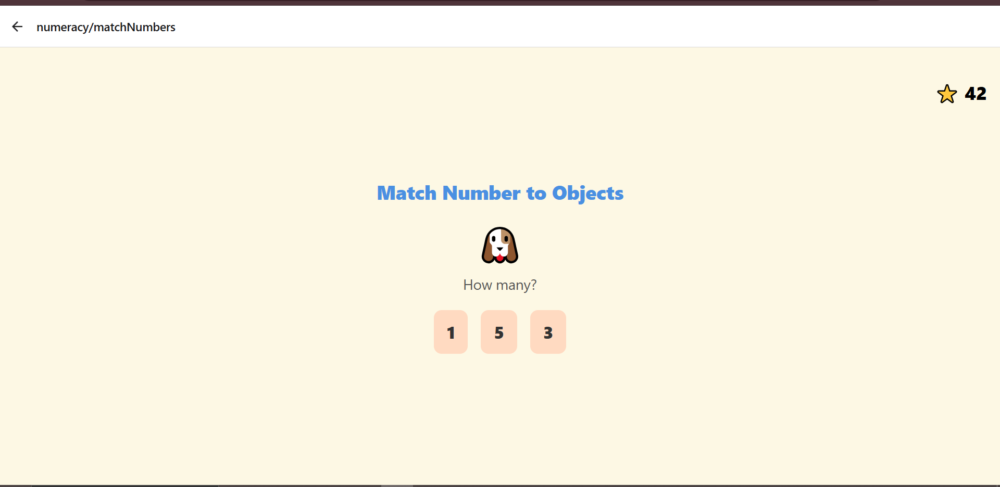
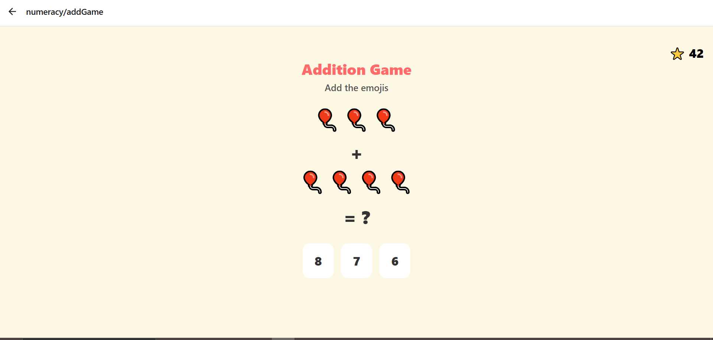
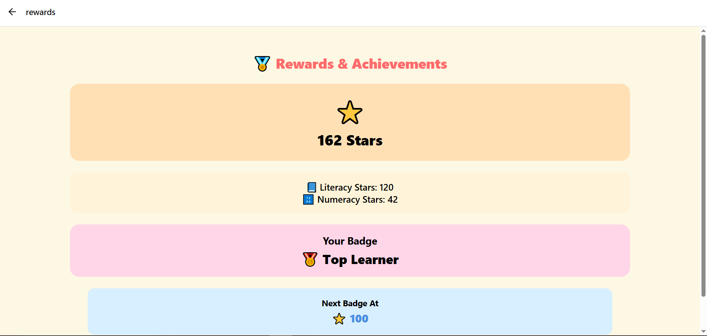
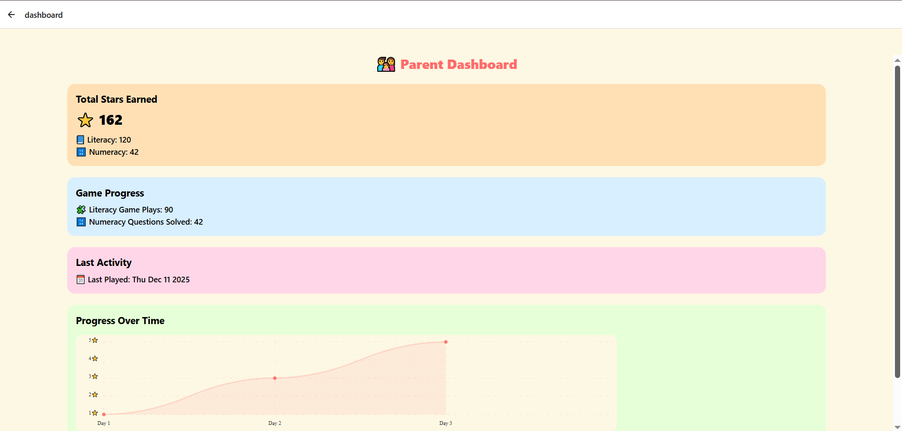

# 🎮 Gamified Learning App for Kids

A child-friendly gamified learning application designed to improve **literacy and numeracy skills** through interactive games, animations, and a reward-based system.

---

## 📌 Project Overview
The Gamified Learning App helps young learners understand basic concepts of letters and numbers using fun activities.  
Parents can track the child’s progress through a dedicated dashboard.

---

## ✨ Key Features
- 📘 Literacy games (Alphabet Flashcards, Word Puzzle)
- 🔢 Numeracy games (Number Matching, Addition-based tasks)
- ⭐ Star-based reward system
- 🏆 Badge unlocking based on performance
- 📊 Parent Dashboard for monitoring progress
- 🎨 Child-friendly UI with animations
- 💾 Offline data storage using AsyncStorage
- 🌐 Supports Web & Mobile using Expo

---

## 🛠️ Technologies Used
- React Native (UI development)
- Expo (cross-platform deployment)
- Expo Router (file-based navigation)
- JavaScript / TypeScript
- AsyncStorage (local data persistence)
- Git & GitHub (version control)

---

## 🚀 How to Run the Project
```bash
1. Clone the repository

git clone https://github.com/your-username/gamified-learning.git


2. Navigate to the project folder

cd gamified-learning


3. Install dependencies

npm install


4. Start the app

npx expo start


5. Run on:

📱 Android device using Expo Go (QR scan)

🌐 Web browser
```

---

## 📸 Screenshots

Note: Screenshots are taken from the web version.
The same application runs on Android devices using Expo Go with similar UI and functionality.


### 🏠 Home Screen


---

### 📘 Literacy Module

**Literacy Games Menu**


**Alphabet Flashcards Game**


**Word Puzzle Game**


---

### 🔢 Numeracy Module

**Numeracy Games Menu**


**Match Numbers Game**


**Addition Game**


---

### ⭐ Rewards Screen


---

### 👨‍👩‍👧 Parent Dashboard

